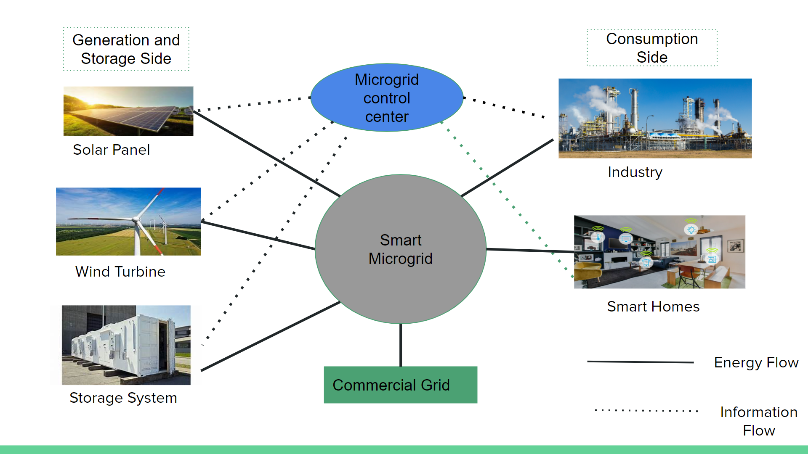
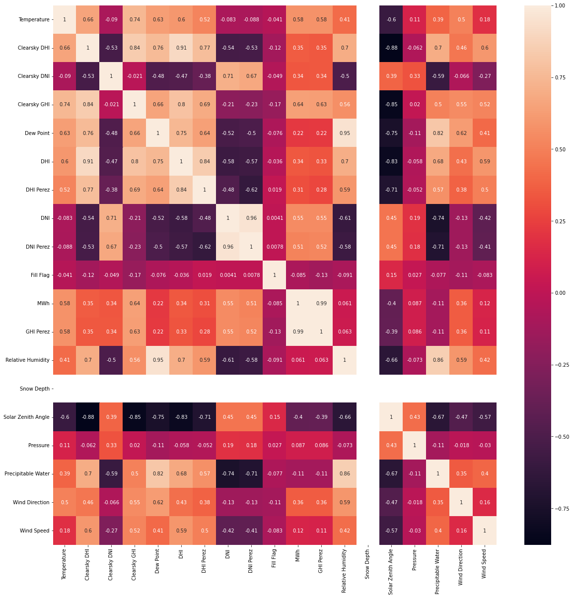

# Short-term-Forecasting-of-Load-and-Solar-Energy-in-a-Micro-grid.
Short term forecasting of renewable energy using Stacked LSTM model and Load using SARIMA model and calculating the net value of energy required from grid.
- In micro grid forcasting for load consumption and renewable energy production like solar energy and wind energy is important for calculation of net energy required from grid or surplus energy injected into the grid.
- Net FLow of energy and Information is show in below diagram.

### LSTM(Long Short term memory)
 LSTM is used for forecasting of renewable energy( solar power in our case). 
 - Finding correlation - correlation heat map is show as below:
 
 - Feature selection
 we tried various feature selection methods like - kselect method, grid search etc
 we used selectting parameters with particular correlation value with solar power generation and not including the feature with same correlation value. we have selected feature - POAI (point of array irradiance), GHI(Global horizontal irradiance), Tmpc(temperature in celcus). RH2M(Relative humidity 2m), solar generation.
 
 
 

 
